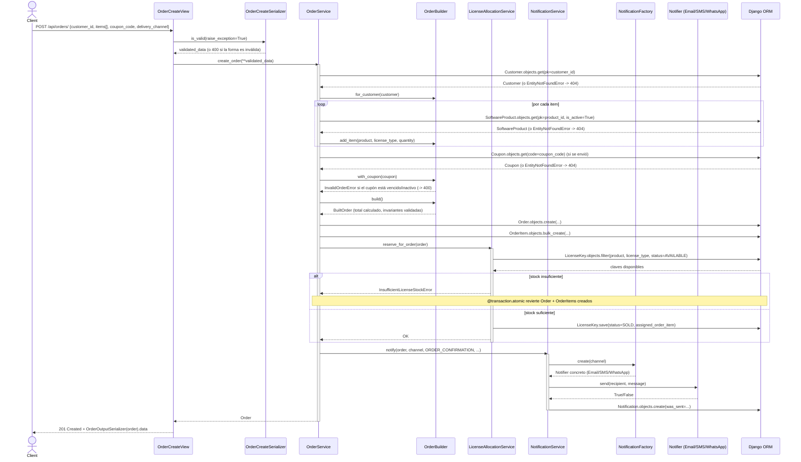

# Sequence Diagram — Checkout (`POST /api/orders/`)

Este es el flujo más complejo del sistema: es el único que atraviesa Serializer → Service → Builder → otro Service → Factory → persistencia → notificación, con dos puntos de falla de negocio distintos (stock insuficiente, cupón inválido) además de la validación de forma del serializer.

## Puntos a resaltar en la sustentación

1. **La vista nunca decide un status code manualmente** salvo el 201 del camino feliz — todos los errores (400/404/409) llegan como excepciones de dominio y se traducen en `common/drf_exception_handler.py`, fuera de este flujo.
2. **El rollback es real, no solo teórico**: `OrderService.create_order` está decorado con `@transaction.atomic`, así que si `LicenseAllocationService` falla *después* de haber creado `Order`/`OrderItem`, esas filas se revierten — verificado en `sales/tests/test_services.py::test_create_order_with_insufficient_stock_raises_and_rolls_back`.
3. **El Builder se usa antes de tocar la base de datos** — `build()` puede fallar (cupón inválido, sin ítems, sin cliente) sin haber escrito nada.
4. **La Factory aparece recién al final**, y solo detrás de la abstracción `Notifier` — `OrderService` nunca sabe qué canal concreto se usó.
