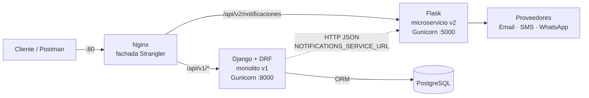
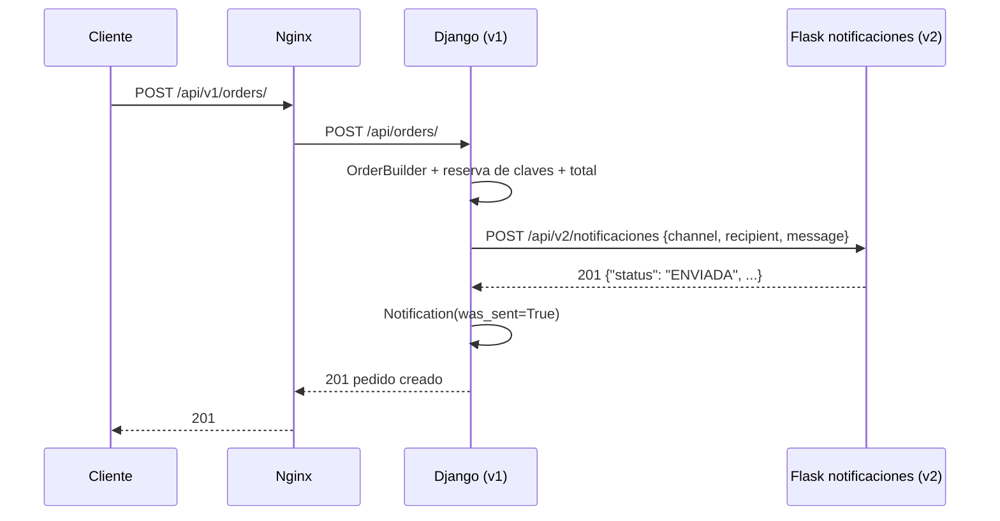

# Migración a Microservicios (Strangler Pattern)

> **Taller 02 — El Patrón Estrangulador.** Primer módulo extraído del monolito Django hacia un microservicio Flask, con Nginx como fachada y todo orquestado con Docker Compose.

**Módulo estrangulado: Notificaciones** (Email / SMS / WhatsApp)

## 1. Matriz de decisión

Evalué los cuatro contextos del monolito con los tres criterios del taller. Cada criterio se califica de 1 (bajo) a 3 (alto), y en *Acoplamiento* un valor alto **juega en contra** de la extracción.

| Módulo | Frecuencia de cambio | Consumo de recursos / latencia | Acoplamiento con la BD | Decisión |
|---|---|---|---|---|
| Catálogo (`catalog`) | 1 · Baja: el portafolio cambia poco | 1 · Baja: lecturas simples | 2 · Media: lo referencian licencias y pedidos | **Mantener en Django** |
| Licenciamiento (`licensing`) | 2 · Media: nuevas reglas de activación | 1 · Baja | 3 · Alta: reserva de claves dentro de la transacción del pedido (`select_for_update`) | **Mantener en Django** |
| Ventas y pagos (`sales`) | 2 · Media: cupones y medios de pago | 2 · Media | 3 · Alta: es el agregado central (Order, OrderItem, Payment, Coupon) | **Mantener en Django** |
| **Notificaciones** (`notifications`) | **3 · Alta:** cada canal nuevo o cambio de proveedor | **3 · Alta:** llamadas de red a proveedores externos (SES, Twilio, WhatsApp API) que bloquean el worker | **1 · Baja:** solo necesita destinatario, canal y mensaje | **Estrangular (Flask)** |

### Justificación

- **Es el único módulo con E/S externa.** Enviar un mensaje depende de la red y de la disponibilidad de terceros. Dentro del monolito, un proveedor lento retiene un worker de Gunicorn en pleno checkout y degrada la creación de pedidos para todos los usuarios.
- **Es el que más cambia.** La auditoría de MyLegitKeys, el negocio real en el que se inspira el proyecto, mostró clientes inalcanzables por email *y* por WhatsApp. Agregar canales, reintentos o *fallback* entre canales es la evolución más probable del sistema, y ahora puede desplegarse sin redesplegar el monolito.
- **Es el que menos se acopla.** El contrato ya estaba aislado desde la Entrega 1 detrás de `Notifier` y `NotificationFactory` (patrón Factory), así que la extracción no rompe ninguna transacción de negocio. En cambio, extraer Licenciamiento o Ventas obligaría a partir transacciones que hoy son atómicas (reserva de claves + pedido).

## 2. Nueva arquitectura



Flujo de un checkout después de la migración:



## 3. Cómo se logró la separación técnica

| Pieza | Archivo | Qué hace |
|---|---|---|
| Microservicio Flask | `proyecto/servicios/notificaciones/app/` | `POST /api/v2/notificaciones` recibe y responde JSON. Usa su propia `NotifierFactory` y valida la entrada. |
| Errores estructurados | `app/errors.py` | Toda respuesta de error tiene la forma `{"error": {"code", "message", "details"}}`: 400 `VALIDATION_ERROR` / `UNSUPPORTED_CHANNEL`, 502 `DELIVERY_FAILED`, 500 `INTERNAL_ERROR` y 404/405 también en JSON. |
| Dockerfile independiente | `proyecto/servicios/notificaciones/Dockerfile` | `python:3.13-alpine` + Gunicorn en el puerto 5000. |
| Orquestación | `proyecto/docker-compose.yml` | `db` (PostgreSQL), `web_django`, `notificaciones_flask` y `nginx`. Solo Nginx publica un puerto (80). |
| Ruteo | `proyecto/nginx/nginx.conf` | `/api/v1/` → Django (reescrito a `/api/`), `/api/v2/notificaciones` → Flask y `/` → Django (lo que aún no se migra). |
| Delegación desde el monolito | `proyecto/notifications/gateways.py` | `RemoteNotifier` cumple el mismo contrato `Notifier`, pero publica el mensaje en el microservicio. `NotificationService` lo elige solo si existe `NOTIFICATIONS_SERVICE_URL`. |

**Decisiones clave**

- **El Service Layer no cambió de interfaz.** `OrderService` sigue llamando a `NotificationService.notify(...)`, y lo único que cambia es la *factory* que se inyecta. Es el payoff directo del patrón Factory de la Entrega 1.
- **La migración es reversible con una variable.** Si se quita `NOTIFICATIONS_SERVICE_URL`, el monolito vuelve a enviar in-process. El rollback no requiere tocar código.
- **Un fallo del servicio no tumba un pedido.** Si Flask no responde, `RemoteNotifier` devuelve `False` y la notificación queda registrada con `was_sent=False`. El checkout sigue.
- **No hay base de datos compartida.** El microservicio no conoce el ORM de Django; su única entrada es el contrato HTTP.

## 4. Impacto esperado

| Aspecto | Antes (monolito) | Después |
|---|---|---|
| Latencia del checkout | Depende del proveedor de mensajería | Aislada: el costo de E/S vive en otro proceso y otro contenedor |
| Escalado | Hay que escalar todo Django | `docker compose up --scale notificaciones_flask=N` escala solo el envío |
| Despliegue de un canal nuevo | Redesplegar el monolito completo | Redesplegar solo el microservicio |
| Fallo de un proveedor | Puede bloquear workers del monolito | Se degrada a `was_sent=False` y la venta continúa |
| Rollback | — | Quitar `NOTIFICATIONS_SERVICE_URL` |

## 5. Evidencia de funcionamiento

Stack levantado con `docker compose up -d --build` (4 contenedores). Logs reales de Nginx con el formato `strangler`, que registra el *upstream* al que se envió cada petición:

```
"GET  /api/v1/customers/ HTTP/1.1"      200 -> upstream=172.18.0.4:8000   # Django
"POST /api/v1/orders/ HTTP/1.1"         201 -> upstream=172.18.0.4:8000   # Django
"POST /api/v2/notificaciones HTTP/1.1"  201 -> upstream=172.18.0.3:5000   # Flask
"POST /api/v2/notificaciones HTTP/1.1"  400 -> upstream=172.18.0.3:5000   # Flask (validación)
```

Delegación del monolito al microservicio al crear el pedido #1 por la v1 (log del contenedor Flask):

```
INFO notificaciones: EMAIL -> demo.customer@mylegitkeys.test: Order #1 received — total 120.00.
```

Error estructurado del microservicio:

```json
{"error": {"code": "VALIDATION_ERROR", "message": "La petición tiene campos inválidos.",
  "details": {"recipient": "Debe ser un correo válido para el canal EMAIL.", "message": "Campo obligatorio."}}}
```

**Pruebas:** 45 del monolito (`python manage.py test`, incluye 5 del *gateway* remoto) y 10 del microservicio (`pytest`).

## 6. Cómo ejecutarlo

```bash
cd proyecto
docker compose up -d --build
curl http://localhost/api/v1/products/                          # -> Django
curl -X POST http://localhost/api/v2/notificaciones \
     -H "Content-Type: application/json" \
     -d '{"channel": "WHATSAPP", "recipient": "+573001234567", "message": "Tu licencia"}'   # -> Flask
docker compose logs nginx                                       # ver a qué backend fue cada petición
```
